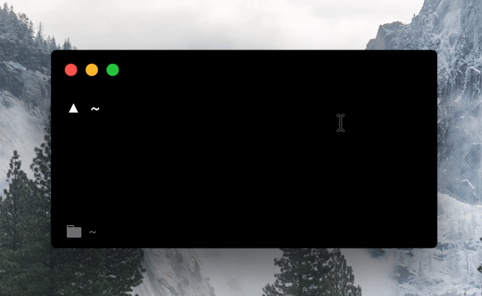

# github-downloads [](https://travis-ci.org/bukinoshita/github-downloads)

> Count Github releases downloads

## Install

```bash
$ npm install -g github-downloads
```

## Usage

```bash
$ git-download --help

  Usage:
    $ git-download <owner/repo>     Show download count

  Example:
    $ git-download bukinoshita/taskr

  Options:
    -h, --help                      Show help options
    -v, --version                   Show version
```

## Demo



## Why

Useful to check download count of an electron app or src code published on
[Github Releases](https://help.github.com/articles/creating-releases/).

## License

MIT © [Bu Kinoshita](https://bukinoshita.io)
